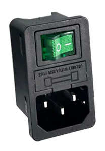
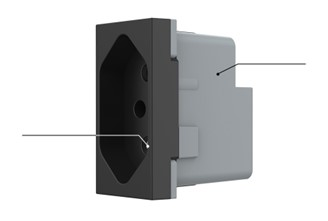

# Terrariumsteuerung
## Shellybox

### Frontplatte

#### Apparatesteckdose mit Schalter und Sicherung

#### Steckdose 3pol

- 3 polig mit Kinderschutz
- Schraub-anschlüsse

- Frontplattenauschnitt: 18,5 x 41mm

### Schema

### Fotos

### Verwendetes Material
- [x] 6x [Shelly 2.5](https://shelly.cloud/products/shelly-25-smart-home-automation-relay/)
- [x] 12x [230V Stecker 2pol weiss](https://de.aliexpress.com/item/32857502251.html)
- [x] 12x [230V Steckdose 3pol schwarz](https://de.aliexpress.com/item/32831956394.html)
- [x] 1x [Apparatesteckdose mit Schalter und Sicherung](https://de.aliexpress.com/item/1005003475027266.html?)
- [x] 14x [Taster grün 230V 12mm](https://de.aliexpress.com/item/1005003575736338.html)
- [x] 14x [Kabel für Taster](https://de.aliexpress.com/item/4001023686738.html)